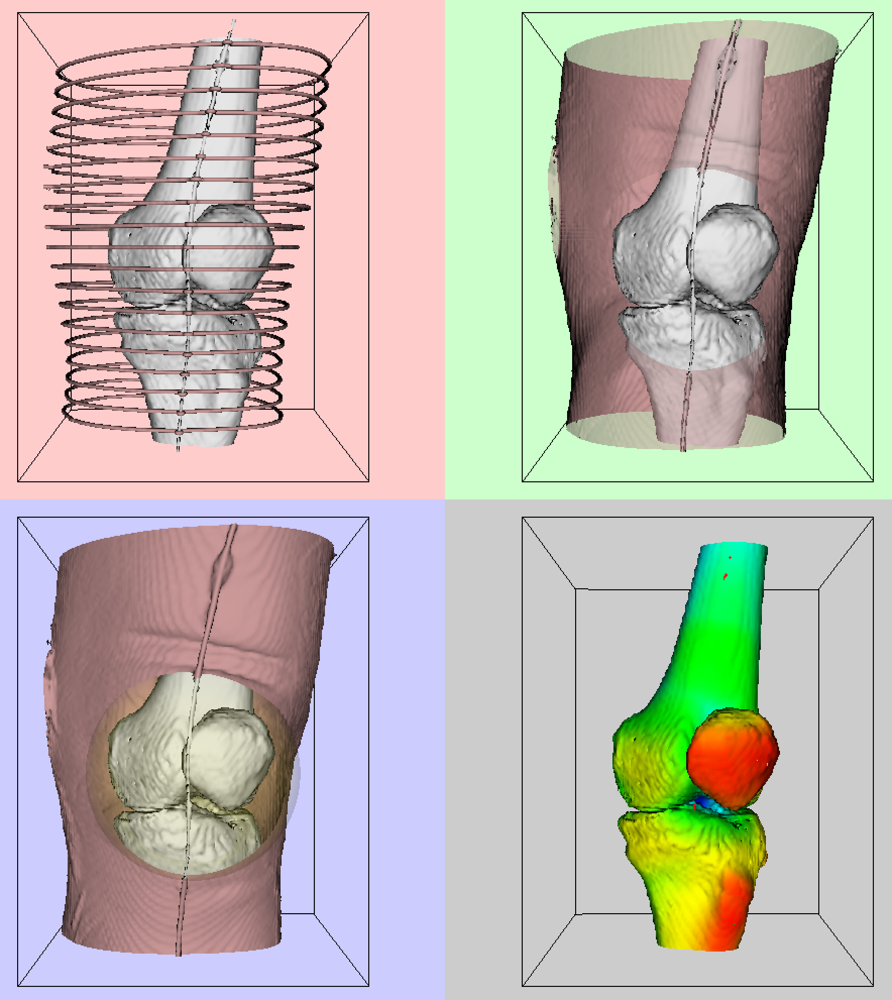

# LABO 4 - SCANNER D'UN GENOU

Le but de ce laboratoire est de vous familiariser avec les notions de contouring, de coupe, de clipping, de fonctions implicites et de certains filtres de modélisation.

Vous devez produire une visualisation du genou similaire à celle fournie dans le [fichier video annexé](https://cyberlearn.hes-so.ch/mod/resource/view.php?id=1103058), à partir des [données scanner brutes](https://cyberlearn.hes-so.ch/mod/resource/view.php?id=1103057) fournies dans le fichier [knee.slc](https://cyberlearn.hes-so.ch/mod/resource/view.php?id=1103059), lisible au moyen d'un vtkSLCReader. Si ces données sont trop lourdes pour la machine sur laquelle vous développez, vous pouvez la sous-échantillonner au moyen de vtkImageResample en spécifiant un AxisMagnificationFactor de 0.5 pour chaque axe. 

On désire visualiser la peau et la surface des os de diverses manières dans 4 Renderers différents que l'on affiche dans la même fenêtre. Leurs caméras sont synchronisées, y compris lorsque l'utilisateur interagit avec elles. Dans chacune des 4 vues, on voit l'outline des données originales et les os du genou. Le rendu original avant interaction affiche le genou tel que vu de face au patient debout. 

- Dans la fenêtre en haut à droite, on voit l'os et la peau en couleurs réalistes. La peau est semi-transparente sur la face avant et opaque sur la face arrière. Elle est clippée par une sphère de manière à laisser voir l'articulation.
- Dans la fenêtre en bas à gauche, la peau est entièrement opaque et la sphère utilisée pour la clipper est visible en transparence.
- Dans la fenêtre en haut à gauche, la peau n'est visible que sous la forme de tubes coupant la surface de la peau horizontalement tous les centimètres.

- Enfin, dans la fenêtre en bas à droite, on ne voit que la surface de l'os, mais celle-ci est colorisée de manière à visualiser la distance entre chaque point de l'os et la peau. Comme la génération de cette donnée de distance est assez lente, je vous encourage vivement à en stocker le résultat dans un fichier .vtk et à ne pas la régénérer à chaque fois. Laissez les deux possibilités disponibles dans votre code. 

Notez qu'un tuyau collé sur la peau du patient apparait tant comme de la peau que comme de l'os. Ne vous en souciez pas. Il est éventuellement possible de le supprimer presque entièrement du polydata représentant les os en utilisant le fait que ce tuyau est plus proche de la peau que toute partie des os. A faire éventuellement en bonus.

Vous devez uniquement rendre le fichier python permettant de générer la visualisation demandée. Si vous utiliser des fichiers .vtk intermédiaires, votre code doit être capable de les générer. 

